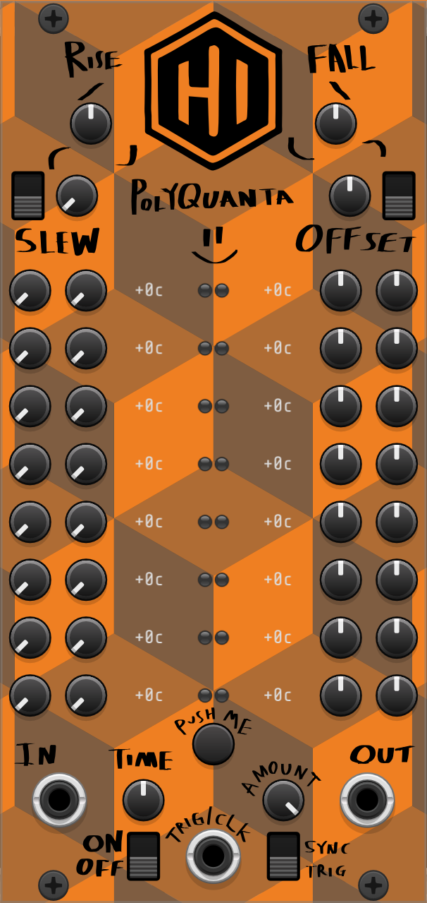

# HugginsIndustries FUNmodules for VCV Rack

Experimental (but musical!) modules for VCV Rack 2. Have **FUN** 🙂


## Contents

* [Modules](#modules)

  * [PolyQuanta](#polyquanta)
  * [Planned modules](#planned-modules)
* [Changelog](#changelog)
* [Requirements](#requirements)
* [Quick start (Windows / MSYS2)](#quick-start-windows--msys2)
* [Build & run with Windsurf/VS Code](#build--run-with-windsurfvs-code)
* [Build from the terminal](#build-from-the-terminal)
* [Unit tests](#unit-tests)
* [Developer tips](#developer-tips)
* [Project layout](#project-layout)
* [License](#license)

## Modules

### PolyQuanta

<p align="center">
  
  <br>
</p>

A **16-channel polyphonic slew/glide + quantizer**. Add controllable portamento, scale-locked notes, and clocked/random motion to mono or poly CV streams.

**Features**

* **Polyphonic**: up to 16 channels (mono-to-poly/poly-to-mono options).
* **Glide/Slew**: both per-channel and global settings.
* **Attenuverter**: global setting (planned: per-channel).
* **Quantizer**: EDO/TET support (many built-in tunings/scales) and custom scale masks (root-relative). cents output displayed per channel.
* **Snap modes**: Nearest / Up / Down / **Directional** (with stable, center-anchored hysteresis).
* **Clocked randomization**: nudge settings at a set time interval (int/ext clock with div/mult) or on trigger. selectable amount globally. (planned: min/max range and amount per channel or globally).
* Designed to be **CPU-light** and friendly for live tweaking.
* **Fun secrets hidden away** 🙂

**Typical uses**

* Quantized portamento for melodic lines.
* Tight, scale-locked arpeggios from smooth LFOs or envelopes.
* Clocked “steppy” motion that still lands on musical notes.
* Poly CV processing for layered voices and chords.
* Generative ambient patches (my favorite).

---

### Planned modules

* **PolyQuantaXL** – A larger take on PolyQuanta with more features, an expanded UI, and additional CV I/O for deeper modulation.

## Changelog

See **[CHANGELOG.md](CHANGELOG.md)** for release history and upcoming changes.

## Requirements

* **VCV Rack 2 SDK** (unzip somewhere simple, e.g. `C:\dev\Rack-SDK`)
* **Windows 10/11 + MSYS2** with the **MINGW64** toolchain:

  ```bash
  # in MSYS2 shell (MSYS2 MinGW 64-bit)
  pacman -S --needed base-devel make zip unzip jq mingw-w64-x86_64-toolchain
  ```
* **Git** (MSYS2 includes one; any recent Git is fine)

## Quick start (Windows / MSYS2)

1. **Open an *MSYS2 MinGW 64-bit* shell**.

2. **Clone the repo**:

   ```bash
   git clone https://github.com/HugginsIndustries/FUNmodules.git
   cd FUNmodules
   ```

3. **Point builds at the Rack SDK** (for this shell session):

   ```bash
   export RACK_DIR=/c/dev/Rack-SDK
   export RACK_SDK=/c/dev/Rack-SDK
   ```

4. **Build & install to your Rack user folder**:

   ```bash
   make -j"$(nproc)"
   make install RACK_USER_DIR="/c/Users/<YOURNAME>/AppData/Local/Rack2"
   ```

5. Launch Rack and enjoy 🎛️

## Build & run with Windsurf/VS Code

This repo ships **tasks** that work even in “assistant” mode (no direct Task API), and also give you a nice **Ctrl + Shift + B** workflow.

* **Default (Ctrl + Shift + B):** `Clean → Build & Install`
* **Other tasks:** `Build`, `Install`, `Clean`, `Quick`, `Build (core tests)`

> The tasks run in an integrated shell and inherit the right MSYS2 environment.
> Set `RACK_DIR`/`RACK_SDK` once per session if not already set (see Quick start).

## Build from the terminal

If you prefer the command line (or you’re in a CI/assistant context), these are the same commands our tasks use:

```bash
# in MSYS2 MinGW 64-bit shell, from the repo root
export RACK_DIR=/c/dev/Rack-SDK
export RACK_SDK=/c/dev/Rack-SDK

# build
make -j"$(nproc)"

# install to your Rack user folder
make install RACK_USER_DIR="/c/Users/<YOURNAME>/AppData/Local/Rack2"

# clean (optional)
make clean
```

## Unit tests

Core DSP tests can be built and executed headlessly:

* **Windsurf/VS Code:** run the task **“Build (core tests)”**
* **Terminal:**

  ```bash
  # Produces build/core_tests and executes it
  make core_tests
  ```

You should see `All core tests passed.` on success.

## Developer tips

* **IntelliSense / clangd:** the repo can generate `compile_commands.json`

  ```bash
  # Generates compile_commands.json with all current build flags
  make compiledb
  ```

  Open the folder in Windsurf/VS Code with the **clangd** and **Makefile Tools** extensions for accurate navigation, go-to-def, etc.

* **Recommended extensions:**
  `llvm-vs-code-extensions.vscode-clangd`, `eamodio.gitlens`, `mikehstech.dotenv`, `github.vscode-pull-request-github`, `github.vscode-github-actions`, `vadimcn.vscode-lldb`, `Gruntfuggly.todo-tree` (see `.vscode/extensions.json`).

## Project layout

```
src/
  core/                // DSP, scales, tests support
    ui/                // module panels & widgets
  PolyQuanta.cpp       // module implementation
tests/                 // unit-test harness (build via task or 'make core_tests')
Makefile               // standard Rack plugin build
```

## License

See **[LICENSE](LICENSE)**.
